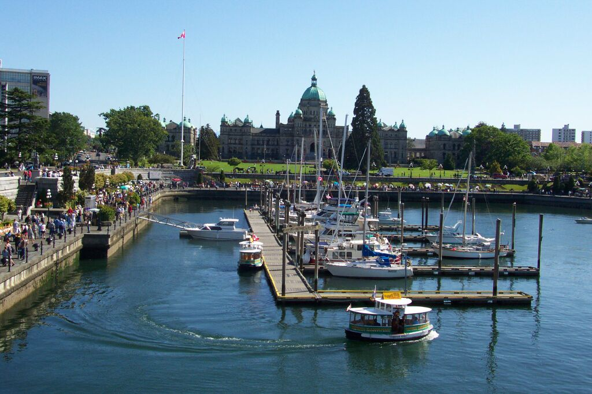

 ## Quiz-1 

        [Quiz]: 다음 이미지에 대한 설명 중 옳지 않은 것은 무엇인가요?
        - (1) 여러 마리의 새가 하늘을 날고 있습니다.
        - (2) 물 위에 보트가 떠 있습니다.
        - (3) 보트 안에는 두 명 이상의 사람이 있습니다.
        - (4) 풍경은 안개 속에 둘러싸여 있습니다.

        Listening: Which of the following descriptions of the image is incorrect?
        - (1) Several birds are flying in the sky.
        - (2) A boat is floating on the water.
        - (3) There are more than two people in the boat.
        - (4) The scene is surrounded by fog.

        [Answer]: (3) 보트 안에는 한 명의 사람만 있습니다.

---------------------

 ## Quiz-2 

I'm unable to display the image, but based on your description and instructions, here is an example of a quiz:

[Quiz]: 다음 이미지에 대한 설명 중 옳지 않은 것은 무엇인가요?
- (1) 여러 척의 보트가 정박되어 있는 항구가 보입니다.
- (2) 건물 앞의 잔디밭에 많은 사람들이 있습니다.
- (3) 건물에는 녹색 지붕이 있습니다.
- (4) 배경에 높은 산이 보입니다.

Listening: Which of the following descriptions of the image is incorrect?
- (1) It shows a harbor with several boats docked.
- (2) There are many people on the lawn in front of the building.
- (3) The building has a green roof.
- (4) There are high mountains in the background.

[Answer]: (4) 배경에 높은 산이 아닌 건물들이 보입니다.

---------------------

